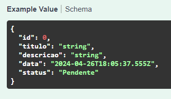

# DIO - Trilha .NET - API e Entity Framework
## Desafio de Projeto: Construindo um Sistema de Agendamento de Tarefas com Entity Framework

## Objetivo e desenvolvimento do projeto:
Construção de um sistema gerenciador de tarefas, onde é possível cadastrar e manipular uma lista de tarefas com CRUD, na forma de uma aplicação Web API.

A classe Tarefa é a principal, sendo composta pelas propriedades Id (int), Titulo (string), Descrição (string), Data (DateTime) e Status (Enum: Pendente, Finalizado).

## Solução:
Este projeto foi desenvolvido com:
- ASP.NET Core 8.0.1
- Entity Framework 8.0.4
- Sql Server 20.1.10
- Newtonsoft Json.NET 6.5.0

O schema de Tarefa é o seguinte:

Os métodos criados pordem ser visualizados no Swagger:

A tabela "Tarefas" no DB Sql Server:

Todos os métodos criados tiveram execuções bem sucedidas e retornaram os resultados esperados.